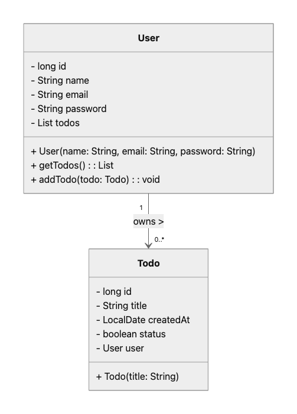
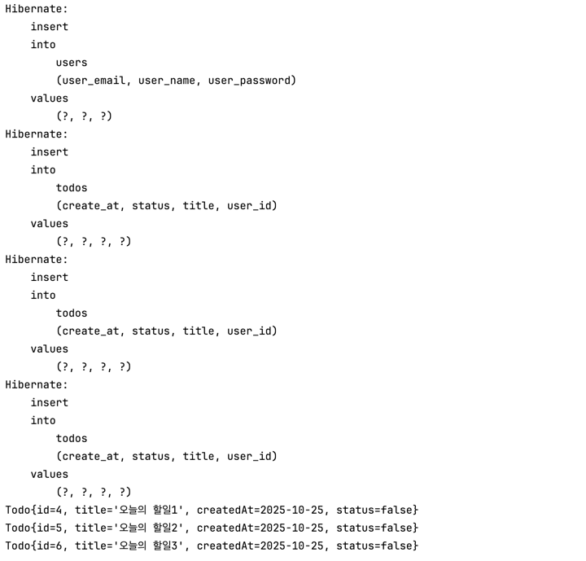

## TODO를 주제로 JPA연습하기

### 구현한 내용의 Class Diagram

- 유저 한명이 여러개의 TODO를 가질 수 있는 상태
- TODO를 생성하고 추가하는 프로세스는 반드시 유저를 거쳐야하는 상태.

### 출력물 

### 아쉬운점
1. 유저 아이디의 필드명을 정하지 않음. (그래서 email을 아이디로 생각함.)
2. Todo의 생성일은 있는데, 만료일이 없음.
3. 날짜 데이터의 범위를 정하지 않았음. (연월일까지 할지 연월일-시간까지 할지)
4. 셋이서 모델링을 진행할 때, 데이터 타입을 정하지 않았음.
5. 필드명이나 메서드명에 대해서 정의하지 않았음.
6. 각 객체(개체)를 생성할 때, 어떤 필드들이 필수 값인지 정하지 않았음.